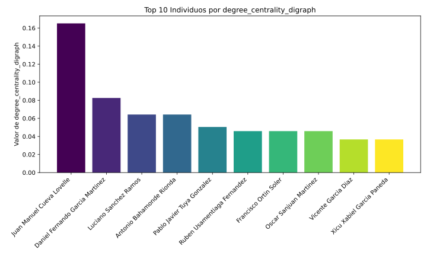
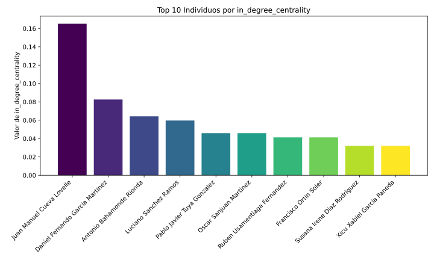
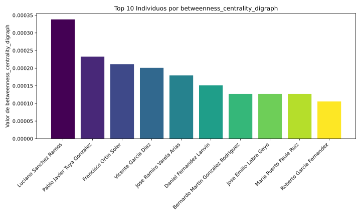
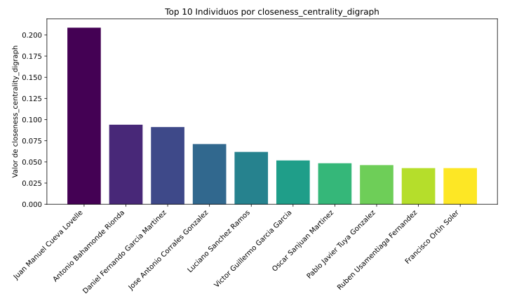

# UniOvi Computer Science Network Analysis

This project analyzes and visualizes the network of PhD theses from the Department of
Computer Science at the University of Oviedo. It scrapes data from the university's thesis
web repository, builds relationship graphs between authors and directors, calculates various
network metrics, and provides both static and interactive visualizations.

## Features

*   **Data Scraping**: Collects thesis data, including titles, authors, directors
                        using Python and Selenium.

*   **Graph Generation**: Creates directed graphs representing thesis supervision
                        relationships using NetworkX.

*   **Network Metrics**: Calculates key centrality metrics (Degree, In-Degree/Prestige,
                        Betweenness, Closeness) to identify influential individuals and
                        structural properties of the network.

*   **Community Detection**: Identifies research communities or clusters within the network
                        using Louvain's Method, the current SOTA in community detection.

*   **Interactive Visualizations**: Generates dynamic and explorable HTML graphs using
                        Pyvis, allowing users to interact with the network.

*   **Static Visualizations**: Produces static SVG images of graphs and barplots of
                        metrics using Matplotlib for quick overviews and reporting.

## Visualizations

### Interactive Network Graphs With Detected Communities

Explore the interactive network visualizations hosted on GitHub Pages:

**[View Interactive Graph](https://pablomsales.github.io/uniovi-cs-network/)**

### Key Metrics

Below are barplots for some of the calculated network metrics, highlighting the top
individuals. Full metric data is available in the `.txt` files within the respective
`metrics` subdirectories.

**Degree Centrality (Directed Graph)**
*Highlights individuals with the most connections (supervisions given and received).*

**In-Degree Centrality / Prestige (Directed Graph)**
*Highlights individuals who have supervised the most theses.*

**Betweenness Centrality (Directed Graph)**
*Highlights individuals who act as bridges or connectors between different parts of the network.*

**Closeness Centrality (Directed Graph)**
*Highlights individuals who are, on average, closest to all other individuals in the network.*

## Technologies Used

*   **Python**: Core language for scripting, data processing, and automation.
    *   **Selenium**: For web scraping thesis data from dynamic web pages.
    *   **NetworkX**: For creating, manipulating, and analyzing complex networks (graphs).
    *   **Matplotlib**: For generating static plots and visualizations, such as bar charts for metrics.
    *   **Pyvis**: For creating interactive network visualizations renderable in HTML.
*   **Git & GitHub**: For version control and project hosting.